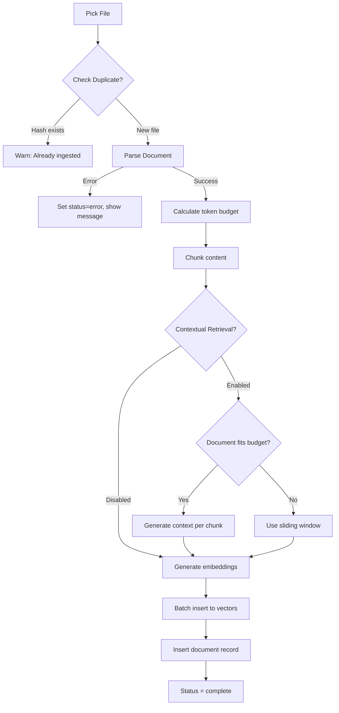

# Document Management & Ingestion Improvements (Refined)

Comprehensive plan to enhance the offline RAG application with multi-format document support, file/folder picking, source attribution, re-indexing capabilities, and Contextual Retrieval for high-tier devices.

## User Review Required

> [!CAUTION]
> **Syncfusion License**: The recommended `syncfusion_flutter_pdf` package requires a [community license](https://www.syncfusion.com/products/communitylicense) (free for <$1M revenue) or commercial license. Alternative: Skip PDF initially and add later with native bindings per platform.

> [!IMPORTANT]
> **Contextual Retrieval Token Limits**: On-device models have limited context windows:
> - High-tier (Gemma 3n E2B): 4096 tokens max
> - This limits full-document context to ~8K characters (~2000 words)
> - Larger documents require **sliding window** or **summary-based** approach
> - Default: OFF (user opt-in required)

> [!WARNING]  
> **Large Document Handling**: Documents >50KB will be ingested in background using isolates. Added user-configurable **max document size** (default: 10MB) in Settings.

---

## Proposed Changes

### Phase 1: Configuration & Settings

#### [MODIFY] [rag_settings_service.dart](file:///media/limcheekin/My%20Passport/ws/rag.wtf/offline_sync/lib/services/rag_settings_service.dart)

Add new settings for document management:

```dart
static const _keyMaxDocumentSizeMB = 'rag_max_doc_size_mb';
int _maxDocumentSizeMB = 10; // Default 10MB

int get maxDocumentSizeMB => _maxDocumentSizeMB;

Future<void> setMaxDocumentSizeMB(int value);
```

### Phase 2: Document Parser Service

New service to extract text content from multiple document formats.

#### [NEW] [document_parser_service.dart](file:///media/limcheekin/My%20Passport/ws/rag.wtf/offline_sync/lib/services/document_parser_service.dart)

```dart
enum DocumentFormat { pdf, docx, epub, markdown, plainText, unknown }

class DocumentParserService {
  DocumentFormat detectFormat(String filePath);
  Future<ParsedDocument> parseDocument(String filePath);
  Future<bool> isSupported(String filePath);
}

class ParsedDocument {
  final String title;
  final String content;
  final DocumentFormat format;
  final int estimatedTokens;  // For budget calculation
  final Map<String, dynamic> metadata;
}
```

**Package Strategy** (ordered by recommendation):

| Format | Package | Cross-Platform | License | Notes |
|--------|---------|----------------|---------|-------|
| PDF | `syncfusion_flutter_pdf` | ✅ All | Community/Commercial | Best quality, requires license |
| PDF (alt) | Native bindings | Linux/Windows only | Apache 2.0 | Fallback for OSS-only |
| DOCX | `archive` + `xml` | ✅ All | BSD | Pure Dart, reliable |
| EPUB | `epub_plus` | ✅ All | MIT | Pure Dart, well-maintained |
| Markdown | Built-in | ✅ All | N/A | Simple String reading |
| Plain Text | `dart:io` | ✅ All | N/A | Fallback for unknown |

**Edge Cases to Handle:**
- Password-protected PDFs → Return error with user message
- Corrupted files → Graceful error, log for debugging
- Empty documents → Reject with "No content found" message
- Extremely large files (>10MB) → Warn user, suggest splitting
- Binary files misnamed → Check magic bytes before parsing

---

### Phase 2: Document Model & Storage

#### [NEW] [document.dart](file:///media/limcheekin/My%20Passport/ws/rag.wtf/offline_sync/lib/models/document.dart)

```dart
class Document {
  final String id;                    // UUID
  final String title;
  final String filePath;              // Original path (may not exist anymore)
  final DocumentFormat format;
  final int chunkCount;
  final int totalCharacters;          // For token estimation
  final String contentHash;           // SHA-256 for change detection
  final DateTime ingestedAt;
  final DateTime? lastRefreshed;
  final IngestionStatus status;       // pending, processing, complete, error
  final bool contextualRetrievalEnabled;
  final String? errorMessage;         // If status == error
}

enum IngestionStatus { pending, processing, complete, error }
```

#### [MODIFY] [vector_store.dart](file:///media/limcheekin/My%20Passport/ws/rag.wtf/offline_sync/lib/services/vector_store.dart)

Add `documents` table and enhanced chunk metadata:

```sql
CREATE TABLE IF NOT EXISTS documents (
  id TEXT PRIMARY KEY,
  title TEXT NOT NULL,
  file_path TEXT NOT NULL,
  format TEXT NOT NULL,
  chunk_count INTEGER NOT NULL,
  total_characters INTEGER NOT NULL,
  content_hash TEXT NOT NULL,
  ingested_at INTEGER NOT NULL,
  last_refreshed INTEGER,
  status TEXT DEFAULT 'complete',
  contextual_retrieval INTEGER DEFAULT 0,
  error_message TEXT
);

-- Add index for hash-based duplicate detection
CREATE INDEX IF NOT EXISTS idx_documents_hash ON documents(content_hash);
```

Update chunk metadata in `vectors` table to include:
- `documentId`, `documentTitle`, `documentPath`
- `chunkIndex`, `totalChunks`
- `hasContext` (boolean for contextual retrieval)

---

### Phase 3: Document Management Service

#### [NEW] [document_management_service.dart](file:///media/limcheekin/My%20Passport/ws/rag.wtf/offline_sync/lib/services/document_management_service.dart)

```dart
class DocumentManagementService {
  // Core operations
  Future<Document> addDocument(String filePath, {bool skipDuplicateCheck = false});
  Future<Document> refreshDocument(String documentId);
  Future<void> deleteDocument(String documentId);
  Future<List<Document>> getAllDocuments();
  
  // Batch operations
  Future<List<Document>> addMultipleDocuments(List<String> filePaths);
  Future<void> deleteAllDocuments();
  
  // Utilities
  Future<bool> hasDocumentChanged(String documentId);
  Future<Document?> findByHash(String contentHash); // Duplicate detection
  Stream<IngestionProgress> get ingestionProgressStream; // UI feedback
}

class IngestionProgress {
  final String documentId;
  final String documentTitle;
  final int currentChunk;
  final int totalChunks;
  final String stage; // parsing, chunking, embedding, contextualizing
}
```

**Ingestion Flow (Improved):**



Update:
1. Check file size against `maxDocumentSizeMB`
2. Parse document content
3. Calculate token budget
4. Chunk content using `SmartChunker` (preserves headers/paragraphs)
5. If Contextual Retrieval enabled, generate context for each chunk
6. Generate embeddings and store in `vectors` table
7. Store document metadata in `documents` table

#### [NEW] [smart_chunker.dart](file:///media/limcheekin/My%20Passport/ws/rag.wtf/offline_sync/lib/services/smart_chunker.dart)

Improve chunking strategy to respect document structure:
- **Markdown**: Split by headers (`#`, `##`) then by paragraphs
- **Code**: Split by class/function boundaries (where possible) or line counts
- **Text**: Split by double-newlines (paragraphs) before character count limits

---

### Phase 4: File/Folder Picker Integration

#### [NEW] [document_management_service.dart](file:///media/limcheekin/My%20Passport/ws/rag.wtf/offline_sync/lib/services/document_management_service.dart)

```dart
class DocumentManagementService {
  // Core operations
  Future<Document> addDocument(String filePath, {bool skipDuplicateCheck = false});
  Future<Document> refreshDocument(String documentId);
  Future<void> deleteDocument(String documentId);
  Future<List<Document>> getAllDocuments();
  
  // Batch operations
  Future<List<Document>> addMultipleDocuments(List<String> filePaths);
  Future<void> deleteAllDocuments();
  
  // Utilities
  Future<bool> hasDocumentChanged(String documentId);
  Future<Document?> findByHash(String contentHash); // Duplicate detection
  Stream<IngestionProgress> get ingestionProgressStream; // UI feedback
  
  // Database maintenance
  Future<void> optimizeDatabase(); // Run VACUUM after deletions
}
```

**Ingestion Flow (Improved):**


---

### Phase 4: Source Attribution

#### [MODIFY] [vector_store.dart](file:///media/limcheekin/My%20Passport/ws/rag.wtf/offline_sync/lib/services/vector_store.dart)

```dart
class SearchResult {
  final String id;
  final String content;
  final double score;
  final Map<String, dynamic> metadata;
  
  // Typed getters for source attribution
  String? get documentId => metadata['documentId'] as String?;
  String? get documentTitle => metadata['documentTitle'] as String?;
  int? get chunkIndex => metadata['chunkIndex'] as int?;
  int? get totalChunks => metadata['totalChunks'] as int?;
  
  /// Preview of chunk (first 150 chars)
  String get preview => content.length > 150 
      ? '${content.substring(0, 150)}...' 
      : content;
}
```

#### [MODIFY] [chat_view.dart](file:///media/limcheekin/My%20Passport/ws/rag.wtf/offline_sync/lib/ui/views/chat/chat_view.dart)

**1. Source Attribution:**
```dart
// Below each AI message
if (message.sources.isNotEmpty)
  SourcesExpansionTile(
    sources: message.sources,
    onSourceTap: (source) => _showSourceDetail(context, source),
  )
```

**2. Chat with Specific Document (Filter):**
- Add "Filter" icon to Chat input area
- Select one or multiple documents to restrict search
- Modify `RagService.askWithRAG` to accept `List<String> documentIds`
- Update `VectorStore` query to filter `WHERE document_id IN (...)`

---

### Phase 5: Re-indexing & Document Library

#### [NEW] [document_library_view.dart](file:///media/limcheekin/My%20Passport/ws/rag.wtf/offline_sync/lib/ui/views/documents/document_library_view.dart)

- **Empty State**: "No documents yet. Tap + to add your first document."
- **List Items**: Format icon, title, chunk count, date, status indicator
- **Actions**: Swipe to delete, tap to view details, long-press for bulk select
- **Header**: Search/filter, sort options (date, name, size)
- **FAB**: Multi-action (Add file, Add folder)

#### [NEW] [document_detail_view.dart](file:///media/limcheekin/My%20Passport/ws/rag.wtf/offline_sync/lib/ui/views/documents/document_detail_view.dart)

- View all chunks for a document
- Toggle Contextual Retrieval (re-ingests if changed)
- Refresh / Delete actions
- Show ingestion timestamp and status

---

### Phase 6: Contextual Retrieval (High-Tier Only)

#### [NEW] [contextual_retrieval_service.dart](file:///media/limcheekin/My%20Passport/ws/rag.wtf/offline_sync/lib/services/contextual_retrieval_service.dart)

```dart
class ContextualRetrievalService {
  // Device gating
  Future<bool> get isSupported; // Checks DeviceTier >= high
  
  // Token budget calculation
  int get maxDocumentTokens; // Based on model's maxTokens
  bool canProcessFullDocument(int documentCharCount);
  
  // Context generation
  Future<String> generateChunkContext({
    required String documentContent,  // Full or windowed
    required String chunk,
  });
  
  // Batch processing with sliding window
  Future<List<ContextualizedChunk>> contextualizeDocument({
    required String documentContent,
    required List<String> chunks,
    void Function(int completed, int total)? onProgress,
  });
}
```

**Token Budget Calculation:**

```dart
// For Gemma 3n E2B (high tier): 4096 tokens max
// Reserve 25% for output = 1024 tokens
// Available for prompt = 3072 tokens
// - Prompt template = ~150 tokens
// - Chunk content = ~100 tokens (max)
// - Available for document = ~2800 tokens ≈ 11,200 chars

int calculateMaxDocumentChars(int modelMaxTokens) {
  final outputReserve = (modelMaxTokens * 0.25).floor();
  final promptOverhead = 150;
  final chunkReserve = 100;
  final available = modelMaxTokens - outputReserve - promptOverhead - chunkReserve;
  return available * 4; // ~4 chars per token
}
```

**Sliding Window Approach for Large Documents:**

```dart
// For documents larger than maxDocumentChars:
// 1. Split document into windows of maxDocumentChars with 20% overlap
// 2. For each chunk, use the window containing it
// 3. This ensures local context is preserved even for large docs

String getRelevantWindow(String fullDoc, String chunk, int maxChars) {
  final chunkStart = fullDoc.indexOf(chunk);
  final windowStart = max(0, chunkStart - maxChars ~/ 2);
  final windowEnd = min(fullDoc.length, windowStart + maxChars);
  return fullDoc.substring(windowStart, windowEnd);
}
```

#### [MODIFY] [rag_settings_service.dart](file:///media/limcheekin/My%20Passport/ws/rag.wtf/offline_sync/lib/services/rag_settings_service.dart)

```dart
static const _keyContextualRetrieval = 'rag_contextual_retrieval_enabled';
bool _contextualRetrievalEnabled = false;

bool get contextualRetrievalEnabled => _contextualRetrievalEnabled;
  
Future<void> setContextualRetrievalEnabled({required bool value});
```

---

### Phase 7: Background Processing & Performance

#### [MODIFY] [document_management_service.dart](file:///media/limcheekin/My%20Passport/ws/rag.wtf/offline_sync/lib/services/document_management_service.dart)

**Background Ingestion with Isolates:**

```dart
// Use compute() for CPU-intensive operations:
// 1. Document parsing (especially PDF)
// 2. Text chunking
// 3. Context generation (multiple LLM calls)

Future<Document> addDocument(String filePath) async {
  // Mark as pending in UI immediately
  final doc = Document(status: IngestionStatus.pending, ...);
  _documentsController.add(doc);
  
  // Heavy lifting in isolate
  final parsed = await compute(_parseDocument, filePath);
  final chunks = await compute(_chunkContent, parsed.content);
  
  // Embeddings must be on main isolate (flutter_gemma constraint)
  for (final chunk in chunks) {
    final embedding = await _embeddingService.generateEmbedding(chunk);
    // ... store
    _progressController.add(IngestionProgress(...));
  }
}
```

**Cancellation Support:**

```dart
class IngestionJob {
  final String documentId;
  bool _cancelled = false;
  
  void cancel() => _cancelled = true;
  bool get isCancelled => _cancelled;
}

// Check isCancelled between chunk processing
for (final chunk in chunks) {
  if (job.isCancelled) {
    await _cleanupPartialIngestion(documentId);
    return;
  }
  // ... process chunk
}
```

---

### Additional Improvements Identified

1. **Storage Estimation UI**: Show estimated storage before ingestion
2. **Import/Export**: Export document library as backup JSON
3. **Document Preview**: Show first 500 chars before full ingestion
4. **Batch Queue**: Queue multiple documents, process sequentially
5. **Conflict Resolution**: Handle file moved/deleted since ingestion
6. **Chunk Viewer**: Debug view to see actual chunks stored
7. **Search Within Document**: Filter RAG to specific document set
8. **Document Tags**: User-defined tags for organization

---

## Verification Plan

### Automated Tests

| Test File | Coverage |
|-----------|----------|
| `document_parser_service_test.dart` | Format detection, parsing each format, error handling |
| `document_management_service_test.dart` | Add/refresh/delete, duplicate detection, hash comparison |
| `contextual_retrieval_service_test.dart` | Token budget, sliding window, context generation |
| `vector_store_test.dart` | New document table, cascade delete, metadata queries |

### Manual Verification

1. **Format Support**: Ingest one file of each format, verify queryable
2. **Large PDF** (>5MB): Verify background processing, UI remains responsive
3. **Duplicate Detection**: Add same file twice, verify warning shown
4. **Source Attribution**: Ask question, verify sources show correct doc/chunk
5. **Re-indexing**: Edit file, refresh, verify new content retrieved
6. **Contextual Retrieval**: Enable on high-tier device, verify context in chunks
7. **Delete Cascade**: Delete document, verify chunks removed from search

---

## Implementation Order (Recommended)

1. **Phase 1-2**: Parser + Model (foundation)
2. **Phase 4**: Source Attribution (quick win, visible improvement)
3. **Phase 3**: Management Service (core logic)
4. **Phase 5**: Document Library UI
5. **Phase 6**: Contextual Retrieval (advanced feature)
6. **Phase 7**: Background processing (polish)
